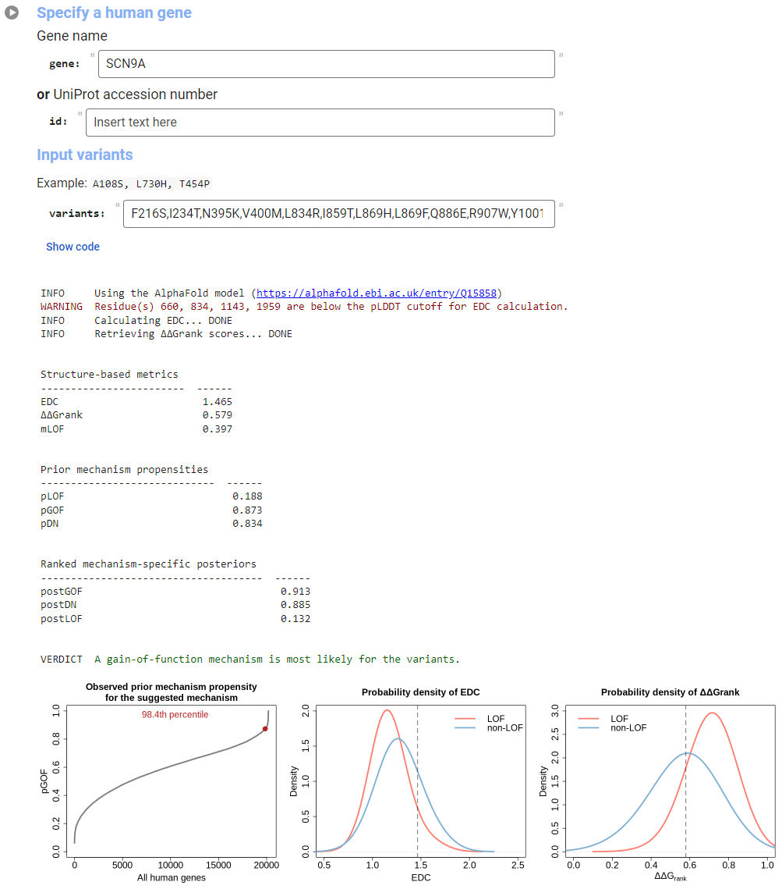

# `mechanism-prediction` 

A Google Colaboratory notebook to predict molecular disease mechanisms for a group of missense variants

<!-- badges: start -->

<!-- badges: end -->

## Description
Molecular disease mechanisms can be categorised into **loss-of-function** (LOF), **gain-of-function** (GOF), and **dominant-negative** (DN) effects. Disease-associated missense variants that induce such effects have different properties at the protein structural level: LOF mutations tend to be highly damaging and more disperesed in the protein structure, whereas DN and GOF variants are generally milder and more clustered. This Google Colaboratory notebook allows users to input a set of missense variants for a human gene and calculate a missense LOF (mLOF) likelihood score based on the energetic and spatial properties of the variants in AlphaFold-predicted structures. The notebook further provides three posterior mechanism-specific likelihood scores by updating gene-level priors with the mLOF score. This information is then used to suggest a molecular mechanism for the input variants.

### Colab input
- The input requires either a **gene name** or a [**UniProt accession number**](https://www.uniprot.org/help/accession_numbers). For gene names, synonyms may be accepted, *e.g.*, *p53* instead of *TP53*. The notebook will map these to their primary UniProt accession number.

- **Missense-only** variants should be provided as a comma separated list, using the one-letter amino acid variant notation, *e.g.*, A64V. The wild-type residue identity and position should be relative to the sequence of the primary UniProt accession number. Any non-mappig variant will be flagged and brought to the user's attention.

- The notebook can be run by clicking on the ▶ symbol ("Run cell") in the top left corner of the input box.

### Colab output
The notebook will generate the following metrics:
- **Structure-based metrics**:
  - <code>EDC</code>: The extent of disease clustering is a measure of how much missense variants are dispersed in the protein structure. Variants associated with DN or GOF mechanisms tend to have higher EDC values, indicating more clustering.
  - <code>ΔΔGrank</code>: ΔΔG is the Gibbs free energy change upon a missense mutation, estimated by [FoldX](https://foldxsuite.crg.eu/). ΔΔGrank is derived from all possible missense variants in a protein, with the resulting values rank-normalised so that 0 represents the mildest mutation in the protein structure and 1 the most damaging. Variants associated with DN or GOF mechanisms tend to have lower ΔΔGrank values.
  - <code>mLOF</code>: The combined structure-based missense LOF likelihood score. LOF variants typically have an mLOF score >0.508.
- **Prior gene-level mechanism likelihoods**:
  - <code>pLOF/GOF/DN</code>: The propensity of a gene to be associated with a given mechanism. Thresholds can be found [here](https://journals.plos.org/plosone/article/figure?id=10.1371/journal.pone.0307312.t001).
- **The ranked mechanism-specific posteriors**:
  - <code>postLOF/GOF/DN</code>: Posterior mechanism-specific scores, whose ranking will determine the suggested mechanism (VERDICT).

### Example

**Example input/output of the Google Colaboratory notebook.**  
The notebook predicts molecular mechanisms for missense variants by accepting a gene name or UniProt ID along with a list of comma-separated variants in one-letter notation.
Results include a link to the gene’s AlphaFold model used for EDC calculation, as well as the <code>EDC</code>, <code>ΔΔGrank</code>, <code>mLOF</code> score, and prior/posterior mechanism scores. The mechanism with the highest posterior score is suggested. Three plots are generated: (1) where the gene’s prior for the suggested mechanism lies relative to all human genes, and (2-3) where the observed <code>EDC</code> and <code>ΔΔGrank</code> values fall within the empirical distributions of LOF and non-LOF genes.

## References
<code>EDC</code> Gerasimavicius *et al*., *Nat Commun* **13**(1) (2022); DOI: [10.1038/s41467-022-31686-6](https://doi.org/10.1038/s41467-022-31686-6)

<code>ΔΔGrank</code> Williams *et al*., *Comput Struct Biotechnol J*, **23** (2024); DOI: [10.1016/j.csbj.2024.08.019](https://doi.org/10.1016/j.csbj.2024.08.019)

<code>pDN, pGOF, pLOF</code> Badonyi & Marsh, *PLOS One*, **19**(8) (2024); DOI: [10.1371/journal.pone.0307312](https://doi.org/10.1371/journal.pone.0307312)

## How to cite this notebook
If you find our <code>mechanism-prediction Colab</code> useful, refer to Badonyi & Marsh, *bioRxiv* (2025); DOI: 

## Contact
[Joseph A Marsh (@marshlab)](https://github.com/marshlab); email: joseph.marsh [at] ed.ac.uk

[Mihaly Badonyi (@badonyi)](https://github.com/marshlab); email: mihaly.badonyi [at] ed.ac.uk
